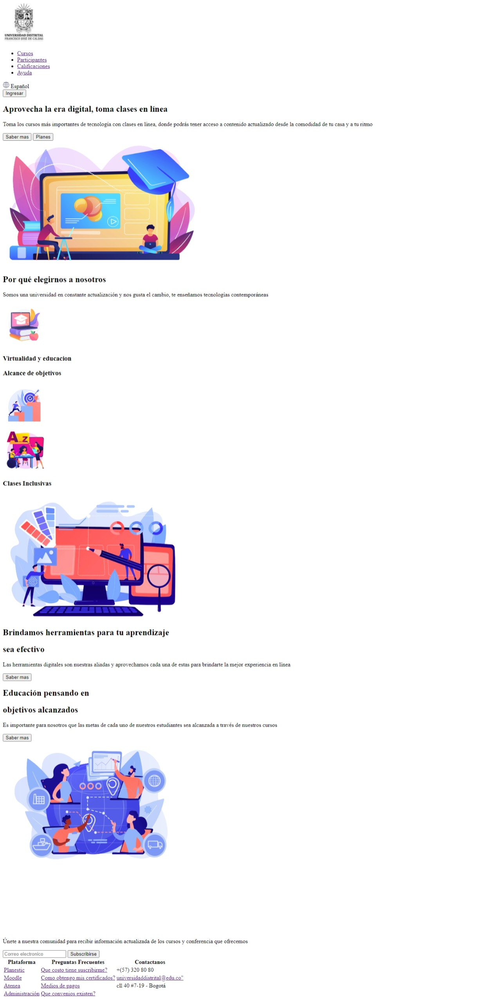
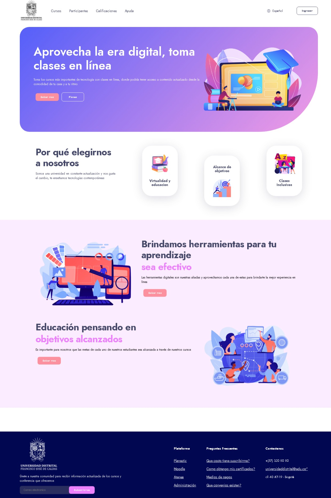

<H1>Taller 9: Johan Medina</h1>

<h2>Informacion</h2>

Curso: Full Stack Basico - Grupo 1

<p<>Profesor: Cristian Patiño

<h2>punto 1: link de figma </h2>
<a href="https://www.figma.com/file/vvgisVZ7pktyrsPtO8Mqkf/Johan-medina-%2F-figma-exercise?type=design&node-id=0%3A1&t=b36g12iHzihTlbPb-1"> link de Figma</a>

<h2>Punto 2: HTML</h2>

<h2>Punto 3: CSS</h2>

